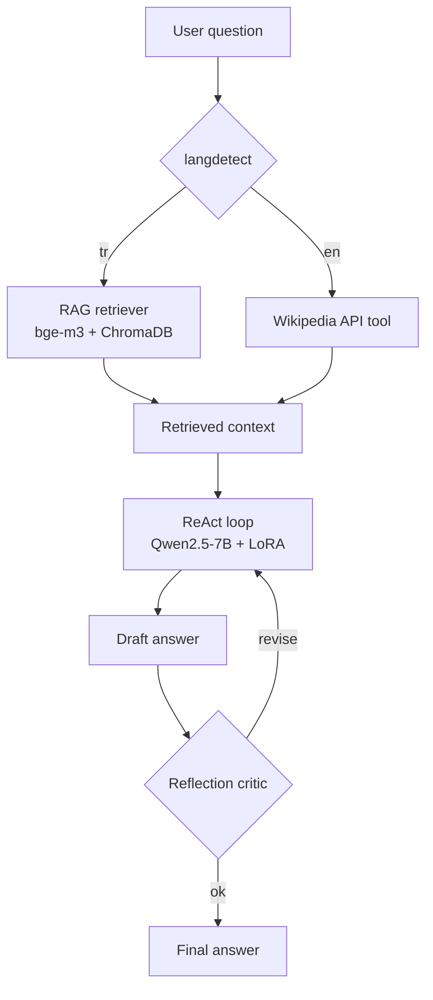

# Task 3 — Agent-Based Multilingual QA System Design

> Implementation is **not** required by the assignment. This document is the deliverable.

The **full technical design document** lives at [`src/task3_agent/DESIGN.md`](../src/task3_agent/DESIGN.md) — it contains the system diagram, prompt templates, code snippets, cost analysis, failure modes, and references.

This file is the **report-form summary** mapping to the assignment's required sections.

---

## Part A — Agent Patterns

### Reflection
A loop where the LLM first *generates* an answer, then in a second pass *critiques* its own output for factual support, completeness, and logical consistency, and optionally *revises* it.

- **Workflow**: `generate → critique → (revise)`
- **Advantages**: cheap quality boost on tasks where errors are detectable from the answer alone (math, code, factual recall); no external tool needed.
- **Limitations**: the critic is the same model — same blind spots; doubles inference cost; can't recover when the model simply lacks the knowledge.
- **Use cases**: long-form writing, code, summarization with constraints, fact-checked QA.

### ReAct (Reasoning + Acting)
Interleaves free-form *Thought* with structured *Action* (tool calls). Each iteration emits an observation that conditions the next thought.

- **Workflow**: `Thought → Action → Observation` loop, terminating on `final_answer` action or iter cap.
- **Advantages**: dynamic; can pull in external/private/fresh knowledge; transparent reasoning trace.
- **Limitations**: cost scales with iteration count; sensitive to action format; can loop on bad observations.
- **Use cases**: knowledge-base / web search QA, multi-hop reasoning, API-orchestration agents.

### Why both for this project
- **ReAct** handles *what to do* (route by language, call the right tool).
- **Reflection** handles *did we do it right* (factuality guard before final answer).

The combination keeps cost bounded (≤7 LLM calls/question) while reducing the failure modes that would hurt grading on factual QA.

---

## Part B — Multilingual Agent System Design

The behaviour spec from the assignment is:

- English question → use **Wikipedia** as the external information source.
- Turkish question → use the **Task 2 RAG knowledge base** (4 MEB lise tarih kitabı, bge-m3 embedded in ChromaDB).

The agent uses language detection (langdetect + LLM fallback) at the entry point as the only branching point. Everything downstream — the LLM, prompt structure, ReAct loop, Reflection critic — is shared between the two paths. Only the active **tool** differs.

See DESIGN.md §B.2 for the routing pseudocode and §B.1 for the trace examples.

---

## Part C — System Architecture and Design Discussion

### 1. Agent Workflow

1. **Language detection** — `langdetect` (deterministic); LLM fallback for short/mixed inputs.
2. **Tool selection** — deterministic switch keyed on language.
3. **Retrieval** — TR: top-5 chunks from ChromaDB via bge-m3; EN: top-1-2 Wikipedia article summaries.
4. **Answer generation** — Qwen2.5-7B + Task 1 LoRA adapter, context-conditioned, MC-letter output.
5. **Optional reflection / verification** — single critique pass; one ReAct retry if `verdict=revise`.

Full step-by-step example traces in DESIGN.md §C.1.

### 2. Tools and Components

| Component | Role | Choice |
|---|---|---|
| LLM | reasoning, tool selection, answer, critique | Qwen2.5-7B-Instruct + Task 1 LoRA (4-bit) |
| Retriever | top-k chunk fetch from MEB corpus | `src.task2_rag.retriever.Retriever` |
| Embedding model | dense Turkish encoding | `BAAI/bge-m3` (normalized cosine) |
| Vector DB | persistent ANN index | ChromaDB (1795 chunks) |
| Wikipedia tool | external EN knowledge | `wikipedia-api` Python package |
| Lang detector | TR vs EN | `langdetect` + LLM fallback |
| Prompt templates | all prompts in one place | YAML registry `configs/agent_prompts.yaml` |

DESIGN.md §C.2 details every component's justification.

### 3. Prompt Engineering

Five critical prompts (full templates in DESIGN.md §C.3):

1. **Language detection** (LLM fallback only) — single-token TR/EN classification.
2. **Query rewrite** — turns multi-choice question into keyword search query (strips noise/distractors).
3. **Answer generation (TR with RAG)** — Turkish system role + injected context + question + MC options → letter output.
4. **Answer generation (EN with Wikipedia)** — same shape, English.
5. **Reflection critique** — strict JSON output: `{"verdict": "ok|revise", "reason": ...}`.

Few-shot examples (3-shot) drawn from TurkishMMLU's `dev` split anchor the answer-letter output format without leaking from `test`.

### 4. Agent Interaction Design

- **Tool dispatcher**: small `TOOLS` dict, action JSON includes `{"tool": ..., "args": {...}}`. JSON-repair pass on malformed outputs.
- **Context injection**: top-5 chunks concatenated with `\n\n---\n\n` separators, capped at 3000 tokens, source IDs preserved as inline footnotes (e.g. `[meb_11]`) for the Reflection step.
- **ReAct coordination**: hard cap at 3 iterations; one revise pass on `Reflection.verdict=revise` with a tighter 2-iter budget on retry.
- **Cost guarantee**: ≤7 LLM calls/question worst case; 3-4 calls in the typical happy path.

DESIGN.md §C.4 has the executable pseudocode and §C.5 has the full worst-case cost table.

### 5. Design Trade-offs

Summarized from DESIGN.md §C.6:

- **One LLM for all roles** (vs. specialised classifiers) — simplicity wins, the LLM is already in VRAM.
- **Hard 3-iter ReAct cap** (vs. adaptive) — predictable cost, MC-QA rarely needs more.
- **Reflection always on** (vs. confidence-gated) — constant overhead, ~$0.05 for 100 questions.
- **bge-m3** (vs. e5-large / OpenAI ada-002) — best Turkish performance, free, local.
- **ChromaDB** (vs. FAISS / Qdrant) — smallest setup, persistent, sufficient at 1795-chunk scale.
- **Wikipedia REST** (vs. local EN KB) — assignment specifies Wikipedia; no need to build a second KB.

### 6. Failure modes & mitigations

Five known failure modes with mitigations in DESIGN.md §C.7 (irrelevant retrieval, Wikipedia disambiguation, malformed JSON actions, context overflow, lang-detect confusion on mixed-script).

---

For the complete document — including code snippets, mermaid diagrams, prompt YAML schemas, and the full reference list — please see **[`src/task3_agent/DESIGN.md`](../src/task3_agent/DESIGN.md)**.
