# Task 3 — Multilingual History-QA Agent: System Design

> The assignment states: *"Design (implementation is not required)…"* — this document is the deliverable. It covers Parts A, B, and C of Task 3 in full.

---

## Part A — Agent Patterns

### A.1 Reflection

**Core idea.** Reflection treats the LLM as both a *generator* and a *critic*. After producing an answer, the model is prompted again to critique its own output — checking factual support, completeness, logical consistency — and decides whether to revise.

**Workflow.**
```
1.  draft  ← LLM(prompt)
2.  critique ← LLM(prompt + draft + critique_template)
3.  if critique.verdict == "revise":
       answer ← LLM(prompt + draft + critique + revise_template)
    else:
       answer ← draft
```

**Why it works.** LLMs are often better at *recognising* errors than *avoiding* them in a single forward pass — the same generative bias that produces the error doesn't fire on a clean evaluation prompt. Reflexion (Shinn et al., 2023) and Self-Refine (Madaan et al., 2023) report 10-20 % gains on reasoning benchmarks.

**Advantages.**
- No external tools required — pure inference loop.
- Often catches hallucinations, missing steps, and constraint violations.
- Easy to bolt on top of any existing prompt.

**Limitations.**
- The critic is the **same model**: it inherits the same blind spots and may confidently approve hallucinations.
- Inference cost roughly doubles (one extra call); triples if a revision is requested.
- Sensitive to critique-prompt phrasing — vague prompts give vague critiques.

**Typical use cases.** Long-form writing, code generation, summarisation with explicit constraints, math/reasoning answers where the answer's form is checkable.

### A.2 ReAct (Reasoning + Acting)

**Core idea.** ReAct interleaves free-form *Thought* with structured *Action* calls (tool use). Each iteration, the model thinks, picks a tool, gets an *Observation*, then thinks again — until it emits a final answer.

**Workflow.**
```
loop until final_answer or max_iters:
    thought       ← LLM(history + reasoning_prompt)
    action_json   ← LLM(history + action_prompt)
    if action == "final_answer": break
    observation   ← tools[action.name](action.args)
    history.append(thought, action_json, observation)
```

A canonical trace looks like:
```
Thought: I need a date for the conquest of Istanbul.
Action: {"tool": "rag_search", "query": "İstanbul'un fethi tarih"}
Observation: "İstanbul'un Fethi, 29 Mayıs 1453 …"
Thought: I have the year. Answer = 1453.
Action: {"tool": "final_answer", "answer": "1453"}
```

**Why it works.** Decouples *what to do* (planning) from *how to do it* (tool execution), letting the model leverage external knowledge it doesn't have memorised. Originally introduced by Yao et al. (2022).

**Advantages.**
- Pulls in fresh / private / domain knowledge via tools (RAG, web, calculators…).
- Naturally handles multi-hop questions (ask, refine, ask again).
- Transparent — the thought trace is a built-in audit log.

**Limitations.**
- Cost grows linearly with iteration count.
- Sensitive to action-format errors (malformed JSON → wasted turn).
- Can loop on bad tool outputs ("retriever returned nothing → reformulate → reformulate → …").
- Hard to bound worst-case latency without a hard iteration cap.

**Typical use cases.** Question answering over private knowledge bases, web search-grounded chat, API-orchestration agents, code-assistant tool use.

### A.3 Why Both Patterns Together for This Project

ReAct gives us the **routing + retrieval** capability we need (TR → RAG, EN → Wikipedia), while Reflection gives us a **factuality guard rail** before the answer leaves the system. History QA is a domain where a confidently wrong date is worse than "I don't know" — so the cost of an extra Reflection call is well spent.

---

## Part B — Multilingual Agent System Design

**Behaviour spec (from the assignment):**

- If the question is in **English** → use **Wikipedia** as the external source.
- If the question is in **Turkish** → use the **Task 2 RAG knowledge base** (4 MEB history textbooks indexed with `bge-m3` in ChromaDB).

### B.1 High-level diagram

```mermaid
flowchart TD
    Q[User question] --> LD{Language detector}
    LD -- "tr" --> RAG[RAG retriever<br/>bge-m3 + ChromaDB]
    LD -- "en" --> WIKI[Wikipedia search tool<br/>wikipedia-api]
    RAG --> CTX[Retrieved context]
    WIKI --> CTX
    CTX --> REACT[ReAct loop<br/>Qwen2.5-7B + LoRA]
    REACT -- needs more info --> RAG
    REACT -- needs more info --> WIKI
    REACT --> DRAFT[Draft answer]
    DRAFT --> REFL{Reflection critic}
    REFL -- "revise" --> REACT
    REFL -- "ok" --> OUT[Final answer]
```



### B.2 Routing logic

Language detection is the **only** branching point. Everything else (LLM, prompts, ReAct loop, Reflection critic) is shared between TR and EN paths — only the *tool* differs.

```python
def detect_language(question: str) -> str:
    # Stage 1: fastText / langdetect — deterministic, free
    try:
        lang = langdetect.detect(question)            # returns ISO 639-1
        if lang in ("tr", "en"):
            return lang
    except LangDetectException:
        pass
    # Stage 2: LLM fallback for borderline inputs (e.g. mixed-script)
    return llm_classify(question, choices=["tr", "en"])
```

We keep an LLM fallback because `langdetect` is unreliable on very short queries (`<10` tokens) where Turkish loanwords and English nouns get confused.

---

## Part C — System Architecture and Design Discussion

### C.1 Agent Workflow

The agent processes each question in **at most 5 LLM calls** (1 detect + 2 ReAct + 1 reflect + 1 optional revise). Bounded cost is critical for grading-time evaluation on the ~100-item TurkishMMLU/History set.

**Step-by-step trace** (Turkish example):

```
INPUT: "İstanbul'un fethi hangi yıldadır? A) 1453 B) 1402 C) 1071 D) 1517 E) 1923"

[1] Language detection
    langdetect("İstanbul'un fethi…") → "tr"   # deterministic, ~1 ms

[2] Tool selection
    chosen_tool = rag_retriever                # because lang == "tr"

[3] Retrieval
    query_rewrite = LLM(question, query_rewrite_prompt)   # → "İstanbul fethi tarih 1453"
    chunks = rag_retriever.retrieve(query_rewrite, k=5)

[4] Answer generation (ReAct iter 1)
    Thought: "Context mentions 1453."
    Action: {"tool": "final_answer", "answer": "A"}

[5] Reflection
    critique = LLM(question, context, draft="A", reflection_prompt)
    verdict: "ok" → return A
```

**English example** (same flow, different tool):

```
INPUT: "When did the Ottoman Empire conquer Constantinople?"

[1] detect → "en"
[2] tool   = wikipedia_search
[3] wiki_summary = wiki.summary("Fall of Constantinople")
[4] ReAct → "1453"
[5] Reflect → "ok"
```

#### C.1.1 Optional Reflection / Verification Steps

Reflection runs **once** per question. The critique prompt asks for a strict JSON verdict:
```
{"verdict": "ok" | "revise", "reason": "<one sentence>"}
```
If `revise`, the agent gets **one** additional ReAct cycle with the critique appended to the context — bounded retry, no infinite loop.

### C.2 Tools and Components

| Component | Role | Concrete choice | Justification |
|---|---|---|---|
| **LLM** | Reasoning, tool selection, draft, critique, final answer | Qwen2.5-7B-Instruct + Task 1 LoRA adapter, 4-bit | Same model as Task 1+2; LoRA adapter improves Turkish output style. Fits comfortably on 32 GB VRAM in NF4. |
| **Retriever (TR)** | Fetch top-k chunks from MEB history corpus | `src.task2_rag.retriever.Retriever` (this repo) | Direct reuse of Task 2 components — no duplication. |
| **Embedding model** | Encode question → dense vector | `BAAI/bge-m3` | SOTA multilingual; very strong on Turkish (verified empirically in retrieval sanity tests, see Task 2). |
| **Vector database** | Store + ANN search 1795 chunks | ChromaDB persistent client | Zero-ops, persistent on disk, cosine distance, fits the project scale. |
| **Wikipedia tool** | Fetch external EN context | `wikipedia-api` + MediaWiki REST fallback | Public, no API key, returns summaries directly. Handles disambiguation pages by picking the first concrete article. |
| **Language detector** | Classify TR vs EN | `langdetect` + LLM fallback | langdetect is deterministic and cheap; LLM fallback covers edge cases. |
| **Prompt templates** | All system + user prompts | YAML registry (`prompts.yaml`) | Decouples prompt engineering from code; lets us version-control prompt changes. |

### C.3 Prompt Engineering

All prompts live in one place (`configs/agent_prompts.yaml`) so they can be iterated on without touching code. The critical ones:

#### C.3.1 Language detection (LLM fallback only)
```
SYSTEM: You are a language identifier.
USER:   Classify the language of the following text. Reply with exactly one
        token: "tr" or "en". No quotes, no explanation.

        Text: {question}

ASSISTANT (expected): tr
```
Used only when `langdetect` returns low confidence or a non-{tr,en} code.

#### C.3.2 Query rewrite (for retrieval)
Multiple-choice questions often contain noise ("Aşağıdakilerden hangisi…"). We rewrite to a keyword-rich query.
```
SYSTEM: Sen bir vektör arama sorgusu yazarısın.
USER:   Aşağıdaki çoktan seçmeli sorudan, vektör veritabanına yönlendirilecek
        kısa (en fazla 12 kelime) bir arama sorgusu üret. Şıkları DAHİL ETME.

        Soru: {question}

ASSISTANT (expected): İstanbul'un fethi tarih
```

#### C.3.3 Answer generation (TR — with RAG context)
```
SYSTEM: Sen Türkçe tarih sorularını cevaplayan bir asistansın. Sana bir bağlam,
        bir soru ve seçenekler verilir. SADECE doğru şıkkın harfini
        (A, B, C, D veya E) ver. Açıklama yapma.

USER:   ### Bağlam:
        {context}      ← top-5 chunks separated by "\n\n---\n\n"

        ### Soru:
        {question}

        ### Seçenekler:
        A) {opt_a}
        B) {opt_b}
        ...

        Cevap (yalnızca harf):
ASSISTANT (expected): C
```

#### C.3.4 Answer generation (EN — with Wikipedia context)
Same structure but English:
```
SYSTEM: You are a history-QA assistant. Use the provided sources to answer.
        Reply with ONLY the letter of the correct option (A-E).

USER:   ### Sources:
        {wiki_summaries}

        ### Question:
        {question}

        ### Options:
        A) ...
        E) ...

        Answer (letter only):
```

#### C.3.5 Reflection critique
```
SYSTEM: You are a strict fact-checker. Verify whether the draft answer is
        supported by the context. Reply in JSON only.

USER:   Question: {question}
        Context (summarized): {context_summary}
        Draft answer: {answer}

        Reply strictly as JSON:
        {"verdict": "ok" | "revise", "reason": "<one sentence>"}
ASSISTANT (expected): {"verdict": "ok", "reason": "Context explicitly states 1453."}
```

#### C.3.6 Few-shot examples
A 3-shot example bank lives at the top of the system message for the answer prompts, drawn from TurkishMMLU's `dev` split (5 examples available). This gives the model the exact target answer format without leaking from `test`.

### C.4 Agent Interaction Design

#### C.4.1 How the agent interacts with tools
Tools are registered in a tiny dispatcher:

```python
TOOLS = {
    "rag_search": lambda q, k=5: retriever.retrieve(q, top_k=k),
    "wiki_search": lambda q: wiki.search_and_summarize(q, sentences=5),
    "final_answer": lambda a: {"answer": a},
}

def run_action(action_json: dict) -> str:
    name = action_json["tool"]
    if name not in TOOLS:
        return f"ERROR: unknown tool {name}"
    return json.dumps(TOOLS[name](**action_json.get("args", {})))
```

The LLM emits structured JSON in its Action turn; the dispatcher executes the tool and pipes the observation back to the next reasoning turn.

#### C.4.2 How retrieved information is injected into prompts

Chunks (or Wikipedia summaries) are concatenated with `\n\n---\n\n` separators and slotted into the `{context}` placeholder. Important details:

- **Context length cap**: 3000 tokens. If retrieved content exceeds this, we truncate from the lowest-similarity chunks first.
- **No raw URLs / page numbers**: only the textual content, to avoid the model parroting metadata.
- **Source tags preserved as metadata**: chunks carry `{"source": "meb_11", "chunk_idx": 42}` in the vector store; we surface the source ID in the prompt as a footnote (`[meb_11]`) so the model can cite — useful for the Reflection step.

#### C.4.3 How reasoning and acting are coordinated (ReAct loop)

```python
def react(question, tool_router, max_iters=3) -> str:
    history = []
    for i in range(max_iters):
        thought = llm.generate(SYSTEM + history + REASONING_PROMPT(question))
        action  = parse_json(llm.generate(SYSTEM + history + [thought] + ACTION_PROMPT))
        if action["tool"] == "final_answer":
            return action["args"]["answer"]
        obs = tool_router(action)
        history.extend([thought, action, obs])
    # exhausted retries — return best guess
    return last_action.get("args", {}).get("answer", "<no answer>")
```

Hard cap at 3 iterations — empirical sweet spot in Yao et al. and our own latency budget.

#### C.4.4 Reflection coordination

Reflection runs **after** the ReAct loop concludes:

```python
draft = react(question, tool_router)
verdict = parse_json(llm.generate(REFLECTION_PROMPT(question, context, draft)))
if verdict["verdict"] == "revise":
    final = react(question + "\n\n[Critic note: " + verdict["reason"] + "]",
                  tool_router, max_iters=2)   # tighter budget on retry
else:
    final = draft
return final
```

### C.5 Worst-case Cost Analysis

| Component | Calls | Avg tokens in/out | Notes |
|---|---|---|---|
| Lang detect (langdetect lib) | 0 LLM | — | Falls back to LLM only when needed (<5 % of inputs in practice) |
| Query rewrite | 1 | ~100 / ~10 | |
| ReAct iter 1 (thought + action) | 1 | ~600 / ~80 | |
| ReAct iter 2 (if needed) | 1 | ~700 / ~80 | Rare for MC-QA |
| Final answer generation | 1 | ~1500 / ~5 | letter-only output |
| Reflection critique | 1 | ~800 / ~20 | |
| Revise pass (if verdict=revise) | 2 | as above | Bounded second ReAct |

Typical happy-path cost: **3-4 LLM calls per question**.
Maximum (revise triggered): **6-7 LLM calls per question**.

For 100 TurkishMMLU questions on our pod (~3 sec/call at batch 1, ~250 input tokens) that's **5-12 minutes** end-to-end — comfortably under any reasonable budget.

### C.6 Design Trade-offs and Justifications

| Decision | Alternative considered | Why we chose this |
|---|---|---|
| One LLM for everything | Specialised models per role (e.g. a small classifier for lang detect) | Simplicity, no extra checkpoints; LLM is already in VRAM. |
| Hard 3-iter ReAct cap | Adaptive cap based on confidence | Predictable cost; MC-QA rarely needs >2 hops. |
| Reflection always on | Only on low-confidence draft | Constant-time overhead; for a 100-question eval, the extra ~$0.05 is negligible. |
| `bge-m3` embeddings | Multilingual-e5-large, OpenAI ada-002 | bge-m3 outperforms both on MIRACL-tr, runs locally, free. |
| ChromaDB | FAISS, Qdrant, pgvector | Smallest setup for the project scale; persistent on disk; trivially restorable on a new pod. |
| Wikipedia REST (not full-text search index) | Build a local English KB | Time/budget constraints — the assignment specifically names Wikipedia for the EN path. |
| YAML prompt registry | In-code f-strings | Lets reviewers/reviewers inspect prompts without reading Python. |

### C.7 Failure Modes & Mitigations

1. **Retriever returns irrelevant chunks** → Reflection catches it, triggers query rewrite with the critique appended.
2. **Wikipedia disambiguation page** → `wikipedia-api` exposes `disambiguation_options`; we follow the first concrete article and log the choice.
3. **Model emits malformed action JSON** → A JSON-repair pass (try `json.loads`, then `ast.literal_eval`, then regex fallback). On total failure, treat as `final_answer = <best guess from thought>`.
4. **Out of context window** (rare with seq 4K) → Truncate context from lowest-similarity chunks first.
5. **Lang detect confused on mixed-script** → fallback to LLM classifier with explicit `tr`/`en` choice.

---

## References

- Hu et al., 2021. *LoRA: Low-Rank Adaptation of Large Language Models.* ICLR 2022.
- Yao et al., 2022. *ReAct: Synergizing Reasoning and Acting in Language Models.* ICLR 2023.
- Shinn et al., 2023. *Reflexion: Language Agents with Verbal Reinforcement Learning.* NeurIPS 2023.
- Madaan et al., 2023. *Self-Refine: Iterative Refinement with Self-Feedback.* NeurIPS 2023.
- Yüksel et al., 2024. *TurkishMMLU: Measuring Massive Multitask Language Understanding in Turkish.* arXiv:2407.12402.
- Chen et al., 2024. *BGE M3-Embedding.* arXiv:2402.03216 (bge-m3 multilingual embeddings).
